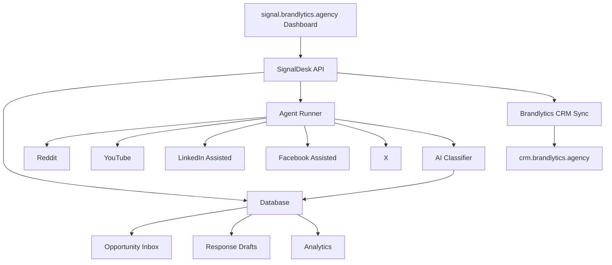
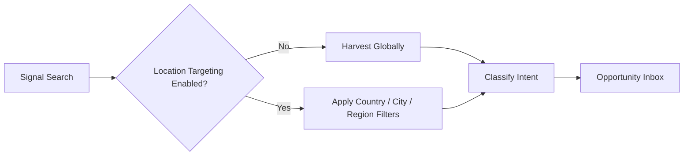

# SignalDesk Core MVP Architecture

## Product Decision

SignalDesk should be a GitHub-backed, Vercel-hosted system with an agentic
engine. It should not be only local, and it should not be only an LLM skill.

The durable parts live in your owned system:

- Dashboard
- Database
- Product and service definitions
- Signal rules
- Opportunity records
- CRM sync logs
- Analytics

The intelligent parts live in an agent runner:

- Signal searching
- Intent classification
- Location reasoning
- Lead scoring
- Response drafting
- Daily briefs
- Recommendations

This lets SignalDesk improve as LLMs improve while the product, data, and
business logic remain under Brandlytics control.

## Tag

Find people already asking for what you sell.

## System Overview



## Core Dashboard Modules

### Products / Services

Defines what the system is listening for.

Examples:

- Prayer app
- Fasting PDF
- Be Freed app
- Construction services
- Real estate services
- Coaching programs
- Legal services

Each product/service stores:

- Name
- Category
- Description
- Target audience
- Problems solved
- Buyer-intent phrases
- Pain phrases
- Offer links
- CTA rules
- Global/local mode
- CRM pipeline mapping

### Signals

Signals are public expressions of need, interest, pain, buying intent,
complaints, recommendation requests, research intent, or partnership
opportunities.

Signal types:

- Need signal
- Pain signal
- Buying signal
- Complaint signal
- Recommendation signal
- Education signal
- Influencer signal
- Trend signal

### Opportunities

Every harvested signal becomes an opportunity card after classification.

Opportunity fields:

- Platform
- Source URL
- Author/profile
- Signal text
- Matched product/service
- Intent type
- Intent score
- Urgency score
- Location mode
- Detected location
- Suggested action
- Status
- CRM sync status

### Responses

SignalDesk drafts responses but should use approval-first posting for the MVP.

Supported response types:

- Public comment
- Direct message
- LinkedIn reply
- Reddit comment
- Facebook group comment
- X reply
- YouTube comment reply
- Influencer outreach
- Soft CTA
- Hard CTA
- No-link value-first response

### Leads

SignalDesk keeps a light lead profile. Brandlytics CRM owns the full
qualification and follow-up process.

### Campaigns

Campaigns group signal-harvesting and outreach work by product/service.

Campaign examples:

- Prayer app global demand
- Be Freed Reddit answering campaign
- Construction leads in Botswana
- Pinterest SEO campaign
- Faceless TikTok content campaign
- Influencer outreach campaign

### Analytics

MVP metrics:

- Signals found
- Qualified opportunities
- High-intent leads
- Leads pushed to Brandlytics CRM
- Signals by platform
- Signals by product/service
- Best phrases
- Best communities
- Response drafts generated

### Settings

Important controls:

- Global mode
- Location mode
- Target locations
- Platforms enabled
- Posting mode
- CRM sync
- Notification rules
- Intent threshold
- Lead push threshold
- Compliance rules
- Blocked communities
- Brand voice

## Global vs Location Toggle

SignalDesk should default to global signal harvesting.

Location targeting is optional and only applied when toggled on.



Recommended defaults:

- Digital products: global on, location off
- Local services: global off, location on
- Courses/PDFs: global on, language targeting optional

## MVP Build Order

1. Dashboard shell
2. Product/service setup
3. Signal rule setup
4. Mock signal runner
5. Reddit connector
6. YouTube connector for selected channels/videos
7. AI classifier
8. Opportunity inbox
9. Response draft generator
10. Brandlytics CRM push
11. Daily signal brief

## First Success Test

SignalDesk is working when it can produce a daily brief like:

```text
Today we found:
42 total signals
18 qualified opportunities
7 high-intent leads
5 leads pushed to Brandlytics CRM
Top platform: Reddit
Top product: Prayer App
Top phrase: "how do I pray"
Best action: value-first reply
```
