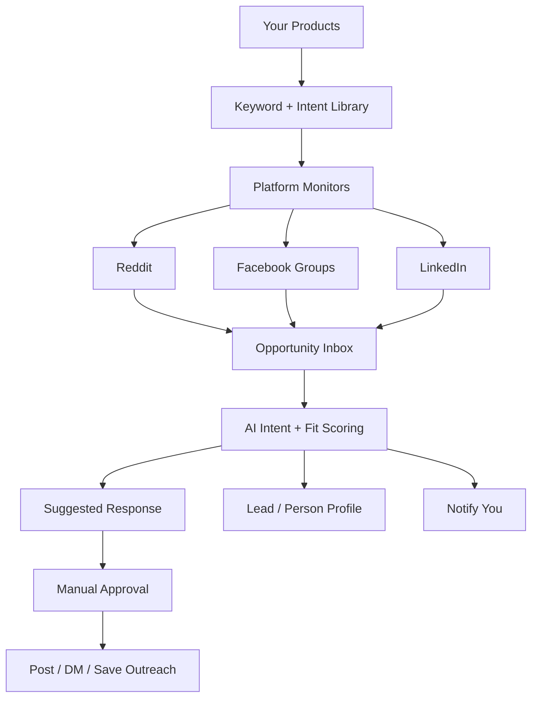
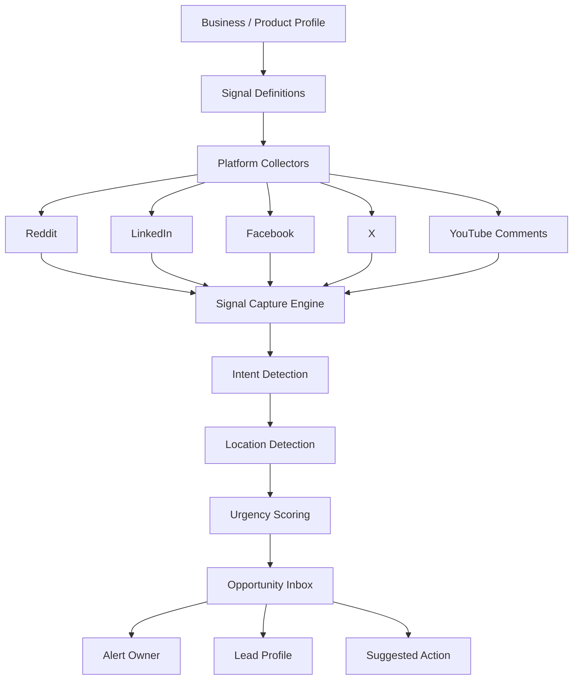
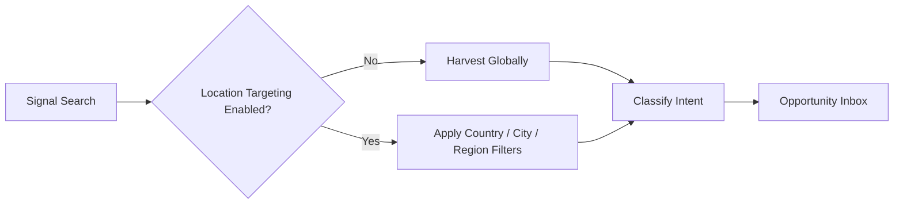
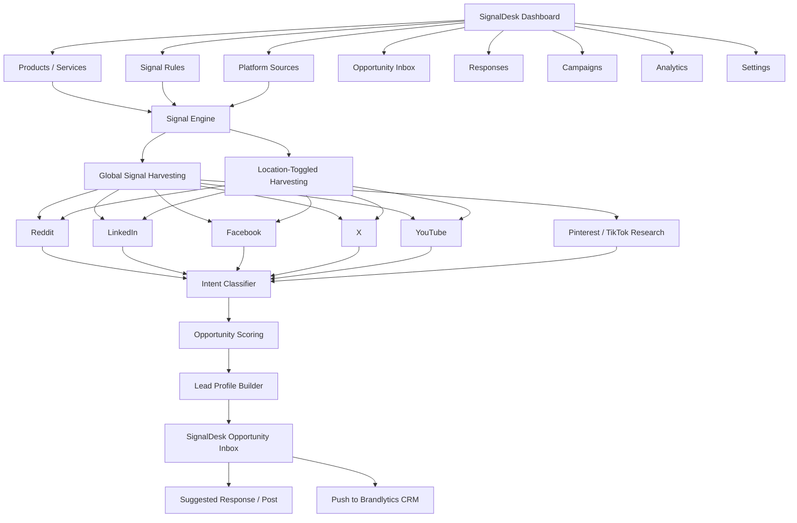
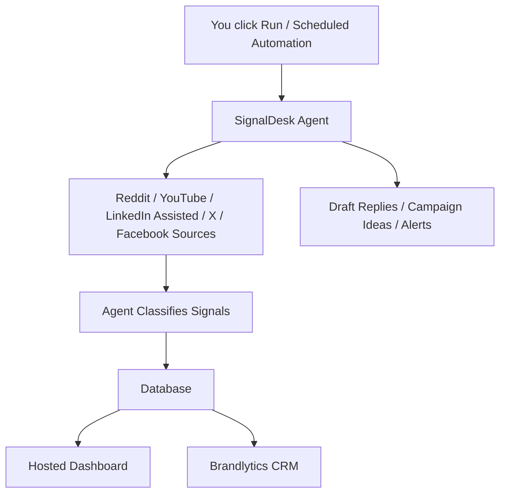
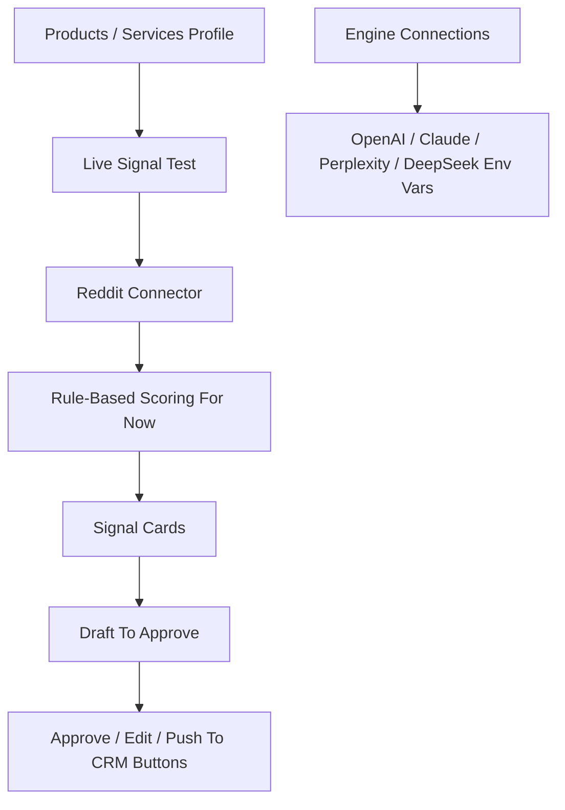

# SignalDesk Developer Handoff

Date: 2026-06-10  
Project: SignalDesk  
Production alias: https://signaldesk-tau.vercel.app  
Target domain: https://signal.brandlytics.agency  
CRM destination: https://crm.brandlytics.agency

## Purpose

This document exports the full product direction from the brainstorming/build
conversation so another developer can continue without deviating.

SignalDesk is not a generic social media scheduler. It is a signal harvesting
and demand-detection engine for Brandlytics.

Core promise:

> Find people already asking for what you sell.

## Original Pain Point

The owner has apps, digital books, PDFs, prayer/fasting resources, the Be Freed
app, and other services/products. The pain point is finding real buyers and
interested people without manually searching Reddit, LinkedIn, Facebook, X,
YouTube, and other public conversation platforms every day.

The owner noticed that Reddit communities are especially responsive because
people gather around specific needs and topics. The same demand-signal pattern
also applies outside spirituality, including construction, coaching, real
estate, legal services, clinics, software, training, and other businesses.

The system must help both:

- The owner's own apps and digital products.
- Other businesses/clients who need leads.

## Concept Evolution From Brainstorming

This section captures the version-by-version evolution of the idea. A developer
should read this before making architectural decisions.

### Version 1: Spiritual Product Awareness System

The first version was imagined around the owner's existing spiritual digital
products:

- Prayer app
- Fasting app/product
- Be Freed app
- Spiritual PDFs/books
- Devotionals, worksheets, guides, courses, or resources

The idea:

> List the products, define the phrases people use when they need help, monitor
> platforms like Reddit, then detect when someone is expressing a need related
> to those products.

Example Prayer App signals:

```text
I need prayer.
Please pray for me.
I don't know how to pray.
How do I pray again?
I feel far from God.
I need a prayer routine.
Fasting and prayer.
Spiritual warfare.
I need encouragement.
```

Example Be Freed signals:

```text
I feel trapped.
I can't break this habit.
I need deliverance.
I keep going back.
I want to be free from shame.
I feel stuck spiritually.
```

The first sketch:



Main early modules:

- Products
- Signals
- Opportunities
- Responses
- Leads
- Campaigns
- Analytics
- Settings

This original module list must be preserved.

### Version 2: Add YouTuber's Marketing Methods As Automated Modules

The owner supplied a transcript from a YouTube video about selling PDFs and
digital products with no audience.

The methods from that video were converted into SignalDesk modules:

1. Pinterest SEO
2. Reddit answering
3. TikTok faceless content
4. Facebook groups
5. Influencer marketing

SignalDesk should not become only a content tool, but these modules are useful
campaign layers after the core signal engine works.

#### Pinterest SEO Module

Purpose:

- Generate Pinterest keywords.
- Create pin titles and descriptions.
- Suggest Canva design angles.
- Link pins to product pages/Gumroad/app landing pages.
- Generate a 30-day pin calendar.

Example for fasting PDF:

```text
Christian fasting guide
How to fast and pray
Biblical fasting plan
7 day prayer and fasting guide
Fasting scriptures printable
```

#### Reddit / Facebook Group Opportunity Module

Purpose:

- Find communities/groups.
- Detect question posts.
- Avoid spammy posting.
- Draft helpful replies.
- Track engagement and follow-ups.

Rule:

```text
Public comments should teach/help first.
Product links should be soft, contextual, and usually after permission/engagement.
```

#### Faceless TikTok Content Module

Purpose:

- Turn products into short-form content ideas.
- Generate slide text.
- Generate captions.
- Generate voiceover scripts.
- Suggest visuals.
- Link each video to a product.

Example Be Freed video idea:

```text
3 signs you're carrying spiritual heaviness
```

Slides:

```text
You keep feeling stuck even after trying everything.
You pray, but you don't know what to say.
You feel shame more than hope.
Start with one honest prayer today.
```

#### Influencer Finder Module

Purpose:

- Find creators with the right audience.
- Check if they already sell competing products.
- Score fit.
- Draft outreach messages.
- Track replies.
- Suggest affiliate deal terms.

Influencer scoring:

- Audience relevance
- Engagement rate
- Content quality
- Spiritual/business alignment
- Existing competing offers
- Partnership likelihood

### Version 3: Industry-Agnostic Signal Intelligence Platform

The owner then clarified:

> Do not limit this to spirituality. It must work for company services too,
> like construction.

This changed the product from a spiritual product awareness system into a
general signal intelligence platform.

The new core:

> Know when people in your market are expressing a need you can solve, where
> they are saying it, how urgent it is, and what action to take next.

Examples of supported categories:

- Spiritual products
- Construction companies
- Plumbers
- Lawyers
- Coaches
- Cleaning companies
- Real estate agents
- Insurance brokers
- Clinics
- Software products
- Training companies
- Event services
- Logistics companies

Construction example signals:

```text
Looking for a contractor in Gaborone.
Need someone to renovate my kitchen.
Who can build a boundary wall?
Any reliable construction company?
My roof is leaking.
Need a quote for paving.
Recommendations for builders in Botswana?
```

The Version 3 sketch:



Strongest differentiator:

```text
Signal Capture Engine
```

It must:

1. Listen across platforms.
2. Detect intent, not just keywords.
3. Understand location when location mode is enabled.
4. Match signal to business/product.
5. Score opportunity.
6. Alert owner.
7. Save to dashboard.
8. Suggest next action.

### Version 4: Global First, Location Optional

The owner emphasized:

> It should not be limited to location. Only when toggled. It must harvest
> signals globally, because with that we can't go wrong.

This became a non-negotiable:

- Global signal harvesting is the default.
- Location filtering only applies when enabled.

Sketch:



Use cases:

Digital prayer product:

```text
Global Mode: On
Location Targeting: Off
```

Construction client:

```text
Global Mode: Off
Location Targeting: On
Locations: Botswana, Gaborone, Francistown
```

Online course/PDF:

```text
Global Mode: On
Location Targeting: Optional
Language Targeting: Optional
```

### Version 5: Brandlytics Ecosystem Integration

The owner already has:

```text
crm.brandlytics.agency
```

So SignalDesk became:

```text
signal.brandlytics.agency
```

The architectural relationship:

```text
SignalDesk = signal harvesting engine
Brandlytics CRM = lead qualification, follow-up, and sales engine
```

SignalDesk should not replace Brandlytics CRM. It supplies it.

Sketch:



### Version 6: Hybrid Agent + Hosted Dashboard

The owner asked an important strategic question:

> Do I need to build this externally as a web app, or can the engine be Codex,
> Claude, OpenAI, etc., with a hosted dashboard?

The agreed answer:

Build a hybrid system.

```text
Dashboard = stable control panel and memory
Agent/LLM engine = intelligence layer that improves as models improve
Database/API = owned Brandlytics infrastructure
```

Sketch:



This avoids stale software because the intelligence layer can use newer models
later, while the dashboard/database stay stable.

### Version 7: GitHub/Vercel Product System

The owner asked:

> That means this becomes a GitHub system, right, not local?

Decision:

- Yes, it should be GitHub-backed and Vercel-hosted.
- Local work is only the development workspace.
- Production belongs on Vercel.
- Repo should be source of truth.

The first MVP repo was created with:

- Next.js dashboard
- Architecture docs
- Brand guide
- Agent protocol
- CRM sync contract
- Mock agent endpoint
- Live Reddit connector scaffold

### Version 8: Current MVP

Current MVP state:



Important:

- Reddit connector is scaffolded.
- Anonymous Reddit search may fail with `403`.
- Reddit OAuth credentials are needed.
- LLM provider keys are displayed but OpenAI/Claude scoring is not fully wired
  yet.

The next step is to make the engine real:

```text
Reddit API -> OpenAI classification/draft -> Opportunity -> Approval -> CRM
```

## Non-Negotiable Product Direction

Do not limit SignalDesk to spirituality.

Spiritual products are one workspace/use case, but the engine must support any
product or service category.

Default behavior:

- Global signal harvesting is ON by default.
- Location targeting is optional and only applied when toggled.
- Local businesses can use location targeting.
- Digital products, PDFs, apps, and courses can harvest globally.

The core differentiator is signal capture, not content scheduling.

SignalDesk must be best at:

1. Harvesting public demand signals.
2. Matching signals to products/services.
3. Scoring intent and urgency.
4. Creating per-signal posting/reply drafts.
5. Letting a human approve before outreach.
6. Pushing qualified leads to Brandlytics CRM.

## Ecosystem Positioning

SignalDesk lives at:

```text
signal.brandlytics.agency
```

Brandlytics CRM lives at:

```text
crm.brandlytics.agency
```

SignalDesk supplies the leads. Brandlytics CRM owns lead qualification,
follow-up, pipeline management, and sales activity.

SignalDesk should push CRM-ready leads into Brandlytics with enough context:

- Source platform
- Source URL
- Username/profile
- Matched product/service
- Signal text
- Intent score
- Urgency score
- Suggested action
- Draft response

## Architecture Decision

The agreed architecture is hybrid:

- A hosted dashboard on Vercel.
- GitHub/repo as source of truth.
- An agentic engine layer powered by OpenAI/Claude/Perplexity/DeepSeek.
- Database and dashboard owned by Brandlytics.
- Scheduled/on-demand scans.
- Brandlytics CRM integration.

Reasoning:

- A pure web app becomes stale if all intelligence is hardcoded.
- A pure LLM/Claude/Codex skill is not enough for multi-user dashboards,
  analytics, clients, CRM sync, audit logs, or future billing.
- The best design is a stable product shell with a replaceable/upgradable AI
  engine layer.

## Dashboard Modules

The dashboard must keep these modules:

1. Products / Services
2. Signals
3. Opportunities
4. Responses
5. Leads
6. Campaigns
7. Analytics
8. Settings
9. Engine Connections
10. Live Signal Test

## Current Implementation

The project is a Next.js app.

Important files:

```text
app/page.tsx
app/globals.css
app/components/live-signal-tester.tsx
app/api/agent/run/route.ts
app/api/signals/reddit/route.ts
lib/mock-agent-run.ts
lib/types.ts
docs/ARCHITECTURE.md
docs/BRAND_GUIDE.md
docs/CRM_SYNC_CONTRACT.md
docs/REALTIME_MVP.md
docs/SIGNALDESK_AGENT_PROTOCOL.md
vercel.json
```

Commit history:

```text
d9ac68e Add engine connection settings
6c4856c Add live Reddit signal test flow
d566e18 Make dashboard navigation functional
b86bf1d Initial SignalDesk MVP
```

## Current Deployment State

The app has been deployed to Vercel project:

```text
signaldesk
```

Working alias:

```text
https://signaldesk-tau.vercel.app
```

Custom domain:

```text
https://signal.brandlytics.agency
```

The custom domain has been attached/aliased in Vercel, but DNS may still need
to be configured at the registrar/DNS provider if it does not resolve publicly.
Earlier Vercel indicated the following record:

```text
A  signal  76.76.21.21
```

## Brand Direction

The owner supplied a design guide inspired by Supabase. It is copied into:

```text
docs/BRAND_GUIDE.md
```

Preserve the current SignalDesk radar-style logo/mark.

Brand guidance:

- White canvas.
- Near-black text.
- Emerald green as the primary chromatic event.
- Thin hairlines.
- Compact technical product UI.
- Avoid decorative gradients, oversized marketing fluff, and generic SaaS
  hero styling.
- Make the product UI feel like a serious operational dashboard.

The previous small tagline pill was rejected as looking cheap. The promise line
was redesigned as a more substantial promise block.

## Navigation Requirement

Sidebar items must respond. They currently link to page anchors.

Sections:

```text
#products
#signals
#opportunities
#responses
#leads
#campaigns
#analytics
#settings
#engine-connections
#live-test
```

Each deep section should provide a simple way back to overview/top so the user
does not need to manually scroll.

## Products / Services Profiling

The owner asked:

> Where do I profile/input my business/services/products to harvest for?

Answer in the product:

The **Products / Services** module is where a user profiles what SignalDesk
should harvest for.

Fields should ultimately include:

- Offer name
- Product/service type
- Problems solved
- Buyer pain phrases
- Signal phrases
- Target audience
- Offer URL
- Global harvesting toggle
- Location targeting toggle
- Target locations if enabled
- CRM pipeline mapping

Current UI has a static/prototype form. It must become database-backed.

## Engine Connections

The owner asked where to connect Claude/OpenAI/Perplexity/DeepSeek.

Answer in the product:

The **Engine Connections** section is where providers are configured.

Required environment variables:

```text
OPENAI_API_KEY
ANTHROPIC_API_KEY
PERPLEXITY_API_KEY
DEEPSEEK_API_KEY
```

Recommended MVP:

- OpenAI first for classification and response drafting.
- Claude second for careful long-form response drafting.
- Perplexity later for research/source enrichment.
- DeepSeek later for lower-cost bulk classification.

The trigger is:

```text
Run signal scan
```

In the current UI this jumps to the Live Signal Test section. In production it
should trigger the full engine:

1. Load product/service profile.
2. Run source connectors.
3. Send candidates to selected LLM provider.
4. Classify signal intent.
5. Score urgency and fit.
6. Generate per-signal drafts.
7. Save opportunities.
8. Allow approval.
9. Push qualified leads to Brandlytics CRM.

## Live Signal Test

The current first real connector is Reddit.

Current route:

```text
GET /api/signals/reddit
```

Current UI:

```text
app/components/live-signal-tester.tsx
```

The UI lets the user enter:

- Offer name
- Reddit search query
- Signal terms
- Optional subreddit

For every found signal, the UI should show:

- Source
- Author
- Subreddit
- Intent score
- Matched terms
- Suggested action
- Draft to approve
- Edit draft
- Approve
- Push to CRM
- Open source link

## Reddit Connector Requirement

Anonymous Reddit JSON search may return `403`. The route now supports Reddit
OAuth client credentials.

Required Vercel env vars:

```text
REDDIT_CLIENT_ID
REDDIT_CLIENT_SECRET
```

The next developer must add credentials in Vercel before expecting real Reddit
search to work reliably.

## Posting / Draft Approval

SignalDesk should not auto-post aggressively.

MVP posting mode:

```text
Draft only, human approval
```

The product must show posting/reply drafts per individual signal, directly in
the matched signal card. The owner explicitly asked where the draft appears.

Do not hide drafts in a generic Responses area only.

Correct flow:

1. Signal is found.
2. Signal card is created.
3. Under that signal, show "Draft to approve".
4. User edits or approves.
5. Only after approval can it be posted/sent or pushed to CRM.

## Platform Strategy

Priority platforms:

1. Reddit
2. YouTube comments
3. LinkedIn
4. Facebook groups
5. X
6. Pinterest/TikTok as campaign/content channels

Reddit is the first MVP connector because it has high-intent public
conversations.

YouTube comments should monitor selected videos/channels/topics. Do not try to
scan all of YouTube.

LinkedIn/Facebook are valuable but more restricted. Start with assisted or
authorized workflows, not brittle scraping.

## Signal Types

SignalDesk should classify these:

- Need signal
- Pain signal
- Buying signal
- Complaint signal
- Recommendation request
- Education/research signal
- Influencer/partnership signal
- Trend signal

Examples:

```text
I need prayer.
How do I pray again?
Looking for a contractor in Gaborone.
Who can recommend a reliable builder?
Does anyone have a fasting plan?
I need an app for...
Where can I buy...
How much does it cost...
```

## Global vs Location Targeting

Global is default.

Location targeting is optional and should only be applied when toggled.

Examples:

Digital product:

```text
Global harvesting: ON
Location targeting: OFF
```

Construction company:

```text
Global harvesting: OFF
Location targeting: ON
Locations: Botswana, Gaborone, Francistown
```

Course/PDF:

```text
Global harvesting: ON
Location targeting: OPTIONAL
Language targeting: OPTIONAL
```

Location can be inferred from:

- Location keywords
- City/country names
- Local groups
- Subreddits
- Hashtags
- Profile/location metadata when available
- Language/local terms

## CRM Sync

SignalDesk should push qualified leads into Brandlytics CRM.

See:

```text
docs/CRM_SYNC_CONTRACT.md
```

Current expected payload includes:

```json
{
  "source": "SignalDesk",
  "workspace_id": "workspace_prayer_products",
  "platform": "reddit",
  "lead_name": "example_user",
  "profile_url": "https://reddit.com/user/example_user",
  "source_url": "https://reddit.com/example",
  "signal_text": "I need help with prayer consistency.",
  "matched_offer": "Prayer App",
  "matched_offer_id": "product_prayer_app",
  "intent_type": "need",
  "intent_score": 87,
  "urgency_score": 63,
  "location": "Global",
  "recommended_action": "Send prayer routine resource after a value-first reply.",
  "response_draft": "A suggested response goes here.",
  "status": "new_signal"
}
```

## Agent Protocol

The system should not be tied to one LLM provider forever.

Use a stable SignalDesk protocol so OpenAI, Claude, Perplexity, DeepSeek, or a
future model can run the same workflow.

See:

```text
docs/SIGNALDESK_AGENT_PROTOCOL.md
```

The protocol must define:

- Input workspace
- Products/services
- Signal rules
- Platforms
- Location mode
- Posting mode
- CRM threshold
- Output signals
- Opportunities
- Response drafts
- CRM-ready leads
- Analytics summary

## Next Engineering Steps

Do these in order:

1. Add Reddit API credentials to Vercel.
2. Add OpenAI API key to Vercel.
3. Replace rule-based scoring/drafting in `/api/signals/reddit` with an AI
   classification/drafting function.
4. Store products/services in a database.
5. Store scan runs, raw signals, opportunities, drafts, and lead sync status.
6. Make Products / Services form save real data.
7. Make Run Signal Scan load saved product profile and scan using its rules.
8. Add edit/approve state to drafts.
9. Add Brandlytics CRM webhook/API integration.
10. Add daily scheduled scan.
11. Add YouTube comments connector.
12. Add LinkedIn/Facebook assisted workflows.

## Suggested Database Tables

```text
workspaces
products_services
signal_rules
platform_sources
scan_runs
raw_signals
classified_signals
opportunities
response_drafts
light_leads
crm_sync_logs
campaigns
analytics_events
engine_connections
settings
```

## Ethics / Compliance

Do not build SignalDesk as a spam bot.

Rules:

- Draft first.
- Human approval before posting.
- Respect community/platform rules.
- Avoid mass-link dropping.
- Value-first responses.
- Product/resource links only where appropriate.
- Do not scrape private groups without authorization.

## What The Developer Must Not Do

Do not:

- Reframe this as a generic CRM.
- Remove Brandlytics CRM from the flow.
- Limit the system to spirituality.
- Make location targeting mandatory.
- Hide posting drafts away from the matched signal.
- Build auto-posting before approval workflow.
- Overfocus on content calendars before the signal engine works.
- Replace the current SignalDesk mark/logo.
- Ignore the Supabase-inspired brand guide.
- Treat the current static cards as the final product.

## Current Known Limitations

- Live Reddit connector needs real Reddit env vars.
- LLM provider keys are displayed in the UI but not fully wired into the
  classification pipeline yet.
- Current scoring/draft generation is mostly rule-based.
- Products/services are not database-backed yet.
- Draft approval buttons are UI placeholders.
- CRM push is not active yet.
- Custom domain may still require DNS configuration.
- GitHub remote was not configured in this session; deployment was done through
  Vercel CLI from the local repo.

## MVP Success Criteria

The next useful milestone is:

```text
User enters Prayer App profile.
User clicks Run Signal Scan.
SignalDesk searches Reddit with authenticated API.
OpenAI classifies results.
High-intent posts appear as opportunities.
Each opportunity has a draft reply to approve.
Approved leads push to Brandlytics CRM.
Daily brief summarizes signals found.
```

Example daily brief:

```text
Today we found:
42 total signals
18 qualified opportunities
7 high-intent leads
5 leads ready for Brandlytics CRM
Top platform: Reddit
Top product: Prayer App
Top phrase: "how do I pray"
Best action: value-first reply
```

## Final Product Description

SignalDesk harvests public demand signals across social platforms and turns
them into qualified opportunities for Brandlytics CRM.

Short version:

> Find people already asking for what you sell.
